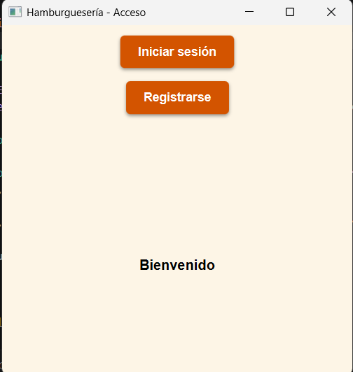
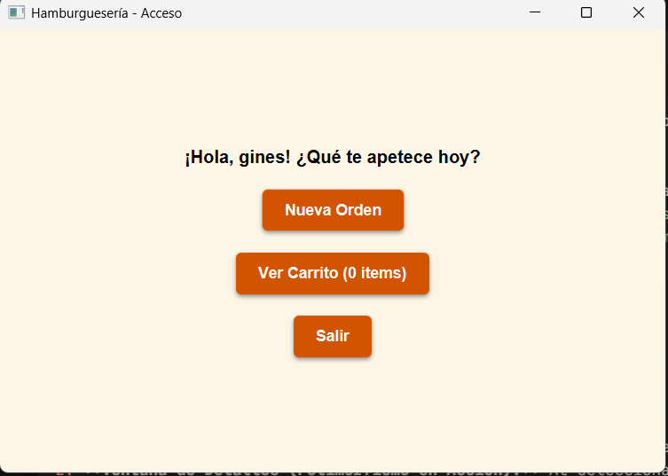
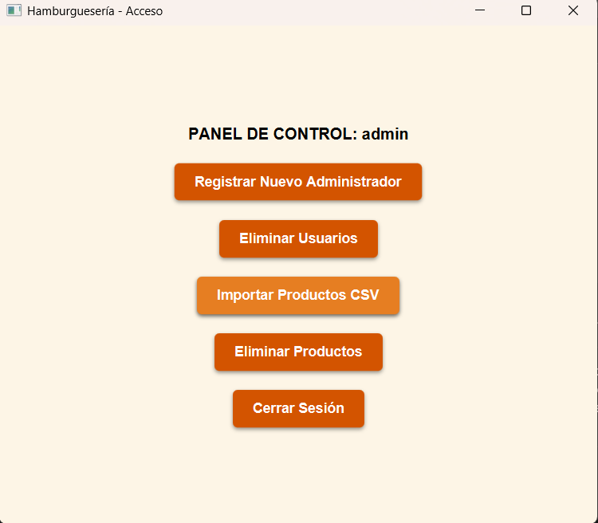

# Sistema de Gestión de Hamburguesería 🍔

Este proyecto consiste en una aplicación de escritorio interactiva y robusta desarrollada para el módulo de **Programación**. El sistema permite centralizar los procesos de un restaurante de comida rápida, permitiendo la interacción directa de los consumidores con el catálogo de productos y ofreciendo un panel administrativo protegido para la gestión del negocio.

---

## 1. Descripción del Proyecto

La aplicación distribuye sus funciones mediante un control de accesos basado en roles de usuario (`Administrador` y `Cliente`), comunicándose dinámicamente con un servidor de bases de datos relacionales:

* **Módulo de Clientes:** Permite a los usuarios registrarse e iniciar sesión de forma segura tras validar sus credenciales. Una vez dentro, disponen de un catálogo dinámico dividido en **Hamburguesas, Bebidas y Extras**. Los clientes seleccionan sus productos favoritos, visualizan sus detalles, interactúan con un carrito virtual y confirman sus compras. Tras procesar el pago, el sistema almacena la transacción en la base de datos y genera automáticamente un ticket físico en formato de texto plano (`.txt`).
* **Módulo de Administración:** Actúa como panel de operaciones del establecimiento. Los administradores disponen de privilegios exclusivos para registrar nuevos administradores, purgar cuentas de usuario inoperantes del sistema, dar de baja productos de forma selectiva y agilizar la actualización del inventario mediante un proceso de importación masiva que lee e inserta datos desde un archivo estructurado `.csv`.

### Tecnologías y Herramientas Utilizadas
* **Lenguaje:** Java (JDK 17)
* **Interfaz Gráfica (GUI):** JavaFX apoyado en hojas de estilo personalizadas (`estilos.css`).
* **Persistencia de Datos:** Motor de base de datos MySQL mediante conectores JDBC.
* **Estructuras Físicas Externas:** Carga selectiva de stock (`.csv`) y exportación automatizada de tickets de caja (`.txt`).

---

## 2. Estructura del Código y Arquitectura

El diseño de la aplicación respeta los principios de modularidad y separación de responsabilidades distribuyendo el código en tres grandes paquetes (`packages`):

```text
RETO_FINAL/
│
├── app/                        # Capa de Negocio e Interfaz de Usuario
│   ├── MainApp.java            # Orquestador visual JavaFX y gestor de pantallas
│   ├── Usuario.java            # Superclase abstracta de usuarios del sistema
│   ├── Administrador.java      # Subclase con credenciales de gestión corporativa
│   ├── Cliente.java            # Subclase orientada al consumidor final
│   ├── Producto.java           # Superclase base del catálogo alimentario
│   ├── Hamburguesa.java        # Entidad hija que añade atributos como tipo de carne
│   ├── Bebida.java             # Entidad hija que añade marcas de control alcohólico
│   ├── Extra.java              # Entidad hija especializada en acompañamientos
│   ├── Pedidos.java            # Lógica del carrito de compras y generación de tickets
│   ├── GenerarInforme.java     # Interfaz abstracta para inyección de polimorfismo
│   └── estilos.css             # Reglas visuales para el diseño de la aplicación
│
├── mysql/                      # Capa de Datos y Persistencia Relacional
│   ├── DataBaseConnection.java # Gestor de canales de conexión mediante DriverManager
│   └── AccessDB.java           # Controladora de operaciones y consultas SQL (CRUD)
│
└── util/                       # Recursos auxiliares del sistema
    ├── LibreriaMetodos.java    # Validaciones algorítmicas (RegEx de seguridad)
    └── productos.csv           # Archivo estructurado de carga masiva de stock
```
## 4. Manual de Usuario (Funcionamiento de la Aplicación)

A continuación se describe detalladamente el flujo de navegación, las reglas de negocio aplicadas y el comportamiento de la interfaz gráfica del sistema.

### 4.1. Pantalla de Acceso y Registro Seguro
Al iniciar la aplicación por primera vez, el sistema ejecuta de forma automática el método `AccessDB.inicializarAdminPorDefecto()`. Si la base de datos está vacía, crea el usuario administrador inicial (`admin` / `admin123`) para asegurar el acceso al sistema.

* **Inicio de Sesión:** El usuario introduce sus credenciales. La aplicación consulta a la base de datos mediante `AccessDB.iniciarSesion()`. Dependiendo del campo `rol` en la tabla SQL, el sistema mapea el resultado polimórficamente devolviendo un objeto `Cliente` o `Administrador`, redirigiendo al usuario a su panel correspondiente.
* **Registro de Nuevos Clientes:** Permite a los consumidores crear una cuenta. Al introducir los datos, la aplicación ejecuta dos validaciones cruciales:
  1. Comprueba si el nombre ya está en uso mediante `AccessDB.existeUsuario()`.
  2. Valida la seguridad de la contraseña con `LibreriaMetodos.comprobarContrasenya()`, exigiendo una longitud mínima de 3 caracteres mediante expresiones regulares (`Regex`). Si todo es correcto, se inserta el registro con el rol "Cliente".



---

### 4.2. Flujo del Entorno de Clientes (Módulo de Compras)
Al acceder como Cliente, la interfaz JavaFX ofrece una navegación intuitiva estructurada para guiar al usuario hasta la consolidación de su pedido.

1. **Exploración del Catálogo Dinámico:** El cliente visualiza tres secciones principales: **Hamburguesas, Bebidas y Extras**. Al hacer clic en cualquiera de ellas, el sistema ejecuta las consultas reactivas `obtenerHamburguesas()`, `obtenerBebidas()` u `obtenerExtras()`, pintando dinámicamente en la pantalla los productos activos con sus respectivos precios y descripciones.
2. **Ventana de Detalles (Polimorfismo en Acción):** Al seleccionar un producto específico del menú, se despliega una ventana emergente informativa. Esta ventana invoca el método sobreescrito `generarInforme()`. Gracias a esto, el sistema sabe discriminar qué atributos únicos mostrar según el tipo de producto seleccionado (por ejemplo, el tipo de carne para las hamburguesas, el tamaño para los extras o si contiene alcohol en las bebidas).
3. **Gestión del Carrito de Compras:** Cada vez que el usuario presiona "Añadir al carrito", el producto se aloja en una lista interna de la clase `Pedidos` y el sistema actualiza acumulativamente el precio total usando el método `agregarProducto()`.
4. **Cierre de Pedido y Emisión de Ticket:** Desde la pantalla del carrito, el cliente puede revisar el listado de sus productos seleccionados. Al pulsar **Confirmar y Pagar**:
   * Se procesa la transacción atómica en la base de datos (`guardarPedido()`).
   * Se genera un archivo físico de texto plano local (`Ticket_Pedido_[ID].txt`). Este archivo utiliza la estructura procesada por `StringBuilder` para simular un ticket de caja de restaurante real con los nombres alineados y el total calculado de forma limpia.



---

### 4.3. Flujo del Entorno de Administración (Panel de Operaciones)
Al iniciar sesión con el rol de "Administrador", la aplicación bloquea el entorno de compras y despliega un panel de control exclusivo enfocado en el mantenimiento de los datos del negocio.

1. **Importación Masiva de Productos (Carga CSV):** Diseñado para evitar la tediosa tarea de registrar los productos uno a uno. El administrador cuenta con un botón para procesar stock. Al pulsarlo, el método `cargarProductosDesdeCSV()` lee el archivo `util/productos.csv`. El sistema analiza la línea de texto, separa los campos por comas y verifica que el nombre no exista en la base de datos. Si el producto es nuevo, lo clasifica por su tipo (1 = Hamburguesa, 2 = Bebida, 3 = Extra) y realiza una inserción doble (en la tabla padre `productos` y en su subtabla correspondiente).
2. **Control de Usuarios del Sistema:** El administrador cuenta con una tabla visualizada en tiempo real que lista a todos los usuarios del sistema (`obtenerTodosLosUsuarios()`). Desde aquí, puede seleccionar cuentas obsoletas o problemáticas y eliminarlas definitivamente de la persistencia de datos mediante el método `eliminarUsuario()`.
3. **Depuración del Catálogo:** Del mismo modo que con los usuarios, el administrador dispone de herramientas de baja comercial para eliminar del catálogo cualquier producto que ya no se vaya a ofertar. Al ejecutar `eliminarProducto()`, las restricciones de Claves Foráneas (`FK`) configuradas en cascada en MySQL se encargan de borrar automáticamente los registros de las subtablas vinculadas, manteniendo la base de datos limpia y sin datos huérfanos.


